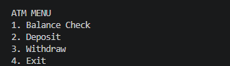
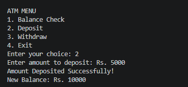
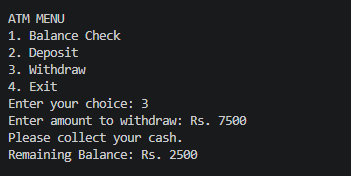
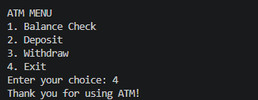

# ATM Simulator

A simple C++ ATM Simulator project with basic
banking operations.

## Screenshots

<table>
   <tr>
    <td align="center"><b>PIN Verification</b> </td>
    <td align="center"><b>Main Menu</b> </td>
  </tr>
   <tr>
    <td align="center"><b>Balance Check</b> </td>
    <td align="center"><b>Cash Deposit</b> </td>
  </tr>
   <tr>
    <td align="center"><b>Cash Withdrawal</b> </td>
    <td align="center"><b>Exit</b> </td>
  </tr>
</table>

## Features

* Check balance
* Withdraw cash
* Deposit cash
* Basic ATM operations
* Menu-based interaction

## Technologies Used

* C++

## Project
This project is developed as a console-based C++ 
application for practicing basic programming 
concepts and ATM Operations.